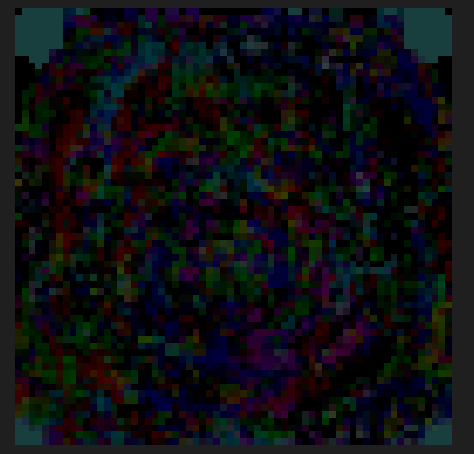
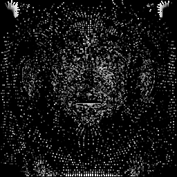

# 一些说明

refs:https://github.com/JiejiangWu/FaceG2E/tree/main?tab=readme-ov-file


`demo_geometry_generation.sh`：优化3DMM生成Mesh的脚本；

`demo_texture_generation.sh`：生成texture的脚本；

`demo_editing.sh`：测试编辑的脚本；

`test_deformation_generate.sh`：测试Deformation map生成的脚本；

`test_displacement.sh`测试displacement map生成的脚本；


暂时没有动edit部分的代码，只使用Prompt+SDS生成mesh，并加入deformation map和displacement map去偏移mesh。

已经测试的运行顺序：geometry->deformation，geometry->displacement，geometry->texture->deformation，geometry->texture->displacement，发现生成的deformation和displacement map没有学到细节的具体信息，推测可能原因有：

- （1）SDS每次2D Diffusion生成的细节不一致，导致没法学到一致的信息；
- （2）deformation 和displacement map的更新逻辑有问题，不确定这两个有没有正确更新，如果正确更新的话每次的逻辑是：

```python
for i in iterations:
    use id in geometry generation part to generate mesh;
   	use deformation or displacement map to update vertex/normal(freeze id);
    DO SDS LOSS WITH STABLE DIFFUSION;
    update deformation or displacement map;
```

但仍不清楚为什么deformation和displacement map像噪声一样，如下图：

deformation（200 iterations，分辨率64x64）：




displacement（200 iterations，分辨率256x256）：



具体的生成中间过程可以看exp文件夹里面。
